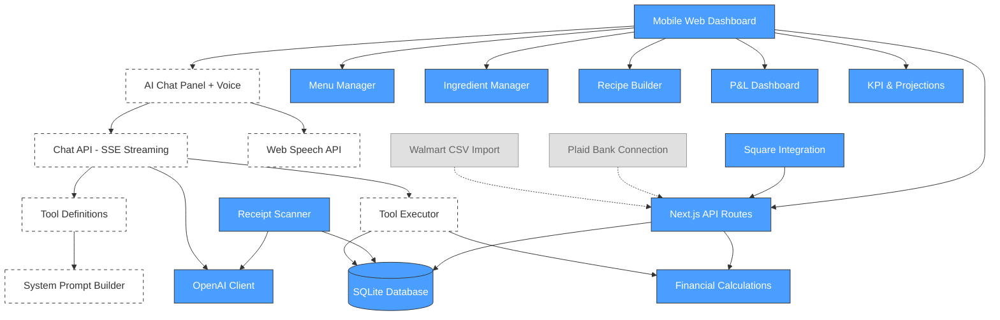

# The Porch Health Park - Financial Dashboard

## Overview
A mobile-friendly web application for restaurant owners to understand their business finances in real-time. Connects to Square (sales/labor), features AI receipt scanning, full P&L reporting, and an AI Assistant Manager that owners can talk to for managing their business.

## Annual Revenue: ~$260K | Target: Profitability optimization + sellable SaaS product

## Tech Stack
- **Framework**: Next.js 16 (App Router, TypeScript)
- **Styling**: Tailwind CSS v4 (mobile-first design)
- **Database**: SQLite via better-sqlite3 (local, simple, no external service needed)
- **AI**: OpenAI GPT-4o (receipt scanning, assistant function calling)
- **Voice**: Web Speech API (browser-native, free)
- **Integrations**: Square SDK (sales, labor, webhooks)
- **Hosting**: Vercel (free tier, streaming support)

## Architecture Diagram

## Phases

### Phase 1: Menu Costing & Foundation (COMPLETE)
- Database schema, menu items, ingredients, recipes, expenses
- Cost calculator, financial calculations engine
- Mobile-friendly UI with color-coded health indicators

### Phase 2: Integrations & Live Data (COMPLETE)
- Square API (sales sync, labor sync, webhooks)
- Receipt scanner with OpenAI Vision + fuzzy matching
- Full P&L dashboard with 12 cost categories
- KPI dashboard, projections, survival score
- Deployed to Vercel

### Phase 3: AI Assistant Manager (NEXT)
- Voice-powered AI assistant (Web Speech API + OpenAI function calling)
- Natural language commands: "Add menu item", "Log expense", "How are sales?"
- Business intelligence: P&L analysis, recommendations, trend insights
- Chat UI: floating button, slide-up panel, action cards, streaming responses

### Phase 4: Future
- Plaid bank connection, Walmart CSV import
- Multi-tenant / SaaS architecture
- Smart alerts, weekly reports
- Voice output (text-to-speech)
